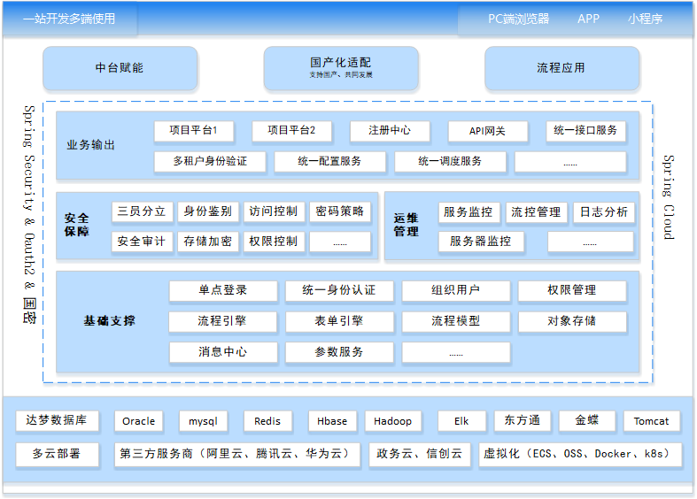

# 介绍

Easyweb是基于Springboot、SpringCloud、Mybatis框架搭建的前后端分离项目，前端基于Vue、Element、qiankun(微前端)框架搭建，集成Activiti工作流引擎于一体。

## 架构图

## 部署图

 ## 服务端口介绍
|类型|名称|服务名|默认端口|服务前缀|
|---|---|---|---|---|
|支撑|网关服务|easyweb-gateway| 8089 |/gateway|
|支撑|登录授权服务|easyweb-auth| 7200 |/auth|
|支撑|组织架构服务|easyweb-system| 7100 |/system|
|支撑|表单服务|easyweb-form| 6100 |/form|
|支撑|模型服务|easyweb-model| 6200 |/model|
|支撑|引擎服务|easyweb-engine| 6300 |/engine|
|共享|文件服务|easyweb-oss| 8100 |/oss|
|共享|消息服务|easyweb-message| 8200 |/message|
|共享|定时服务|easyweb-job| 8500 |/|

