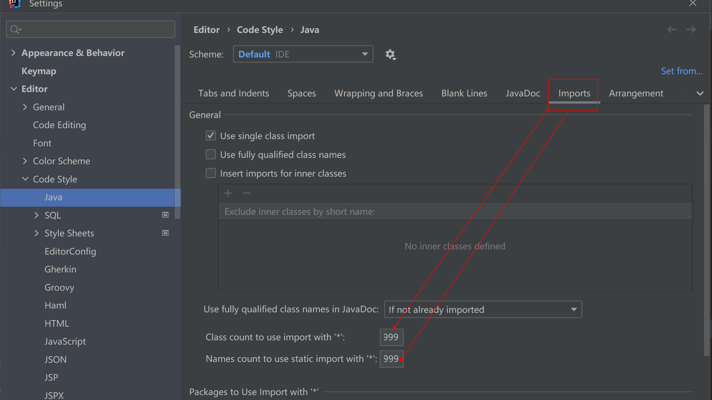
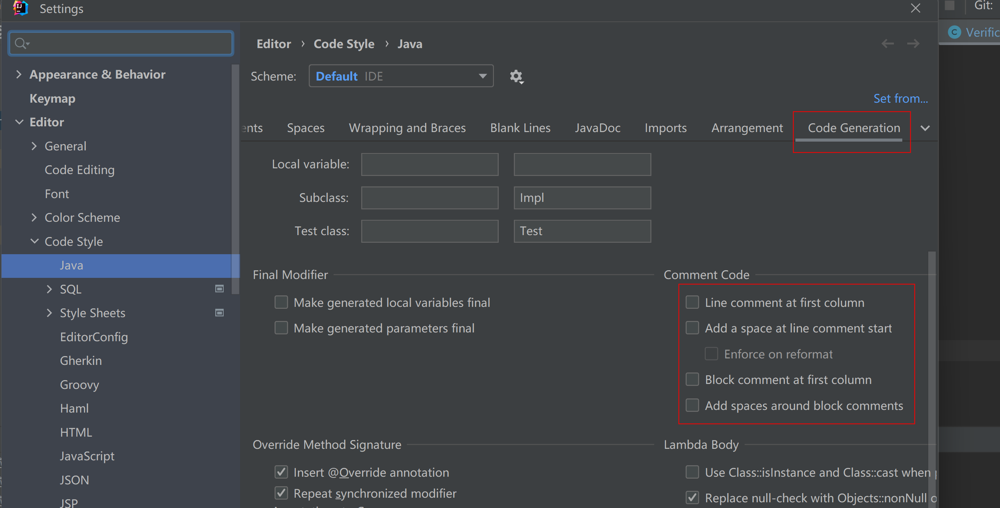
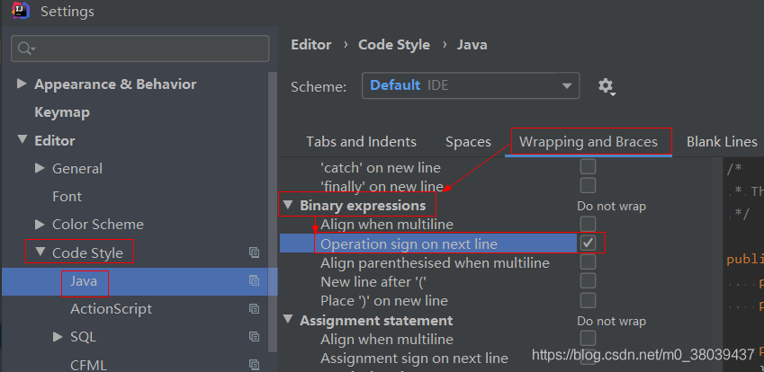

# 快速上手

::: warning 前提条件
新建项目前端均从中台组下载项目模板，项目模板包含登陆、首页、个人中心、菜单等基本框架功能。
并告知管理员新建租户，获取appId、cient_id、client_secret
项目模板地址：
:::


## 注解说明

### @EnableCustomConfig

服务启动类可以通过`@EnableCustomConfig `进行服务的初始化配置。该注解主要有以下几个作用：

1. MappScan扫描支持
2. ComponentScan扫描支持

### @LoginUser

在controller参数中通过`@LoginUser SysUser loginUser` 获取当前登录用户
**示例**

 ```java
@GetMapping(value = "/functions/manage", produces = {"application/json; charset=utf-8"})
public ResponseEntity queryManageFunctions(@LoginUser SysUser loginUser){
        // ... 
        }
```

### @Log(title = "流程设计", businessType = BusinessType.INSERT)

在controller方法上通过注解`@Log `实现操作日志收集(主要针对曾、删、改操作)
**示例**

 ```java
@PostMapping("")
@ApiOperation(value = "流程定义保存")
@Log(title = "流程设计", businessType = BusinessType.INSERT)
public ResObject saveBpmDefinition(@Validated(ValidType.Default.class) @RequestBody BpmDefinitionDesignVO vo){

        }
```

### @Cacheable 加缓存注解

@Cacheable(value = CacheConstants.WF_PRO_SET, key = CacheConstants.WF_PRO_SET + "+'_'+#defId+'_'+#appId")

#### 清除缓存注解@CacheEvict

@CacheEvict(value = CacheConstants.WF_PRO_SET, allEntries = true)

```
@CacheEvict(value = CacheConstants.WF_PRO_SET, allEntries = true)
public void saveProcessTaskForm(SysUser user, BpmFormSetVO bpmFormSetVO) {

}
```

### @DataScope service类上注解，实体类作为参数需要将实体类集成BaseEntity，
业务表需要存机构表UNIT_CODE_LINK字段数据（查询子级数据时需要），部门表ANCESTORS字段数据村上（查询子级部门数据时需要）
@DataScope(unitIdColumn="updator_unit",deptIdColumn="updator_dept",userIdColumn="creator_id")

|注解属性|注释|
|---|---|
|unitIdColumn|业务表对应机构id字段名(默认：unit_id)|
|unitLinkColumn|业务表对应机构link字段名（查本下级用）(默认：unit_link)|
|deptIdColumn|业务表对应部门id字段名(默认：dept_id)|
|deptLinkColumn|业务表对应部门link字段名（查本下级用）（默认：dept_link)|
|userIdColumn|业务表对应用户id字段名（默认：user_id)|
|noColumn|业务表不存在以上哪几个字段需要标明{"column1","column2"}|

### @Valid

`@Valid`会对被标注的controller入参类进行参数校验

被标注的类中有`@Length`注解标注的字段，则该字段不能超过指定长度

被标注的类有`@NotBlank`注解标注的字段，则该字段不能为空

更多参数校验注解请参考hibernate validator

当校验条件不满足的时候，会进入统一异常处理，统一异常处理会给前端返回code为0，message为指定message的消息

**示例**

```java
public ResponseEntity save(@Valid @RequestBody DeptBasic dept){}
```

```java
public class DeptBasic implements Serializable {

    @NotBlank(message = "部门名称不可为空")
    private String jgMc;

    @Length(max = 1, message = "选用标志长度最大为1")
    private String xybs;

    ...
}
```


### @EnableCustomSwagger2

`@EnableCustomSwagger2` 对在线api文档支持，/doc.html访问swagger加强

为完善api接口管理文档，在类、方法上还需要加上@Api..注解完善信息

controller类上必须加上`@Api(tags = "标签")`

controller内的http请求方法必须加上`@ApiOperation("摘要")`

### @Api

`@Api`使用在类上，表明是swagger资源，@API拥有两个属性:value、tags.

生成的api文档会根据tags分类,tags如果有多个值，会生成多个list，每个list都显示所有接口.

value的作用类似tags,但是不能有多个值

**示例**

```java
@Api(tags = "Api管理")
public class SysApiController {}
```

### @ApiOperation

`@ApiOperation`使用于在方法上，表示一个http请求的操作. 常用属性：

value用于方法描述

notes用于提示内容

tags可以重新分组

**示例**

```java
@ApiOperation(value = "汉字转拼音", notes = "汉字转拼音")
public AjaxResult getPinyin() {}
```

### 数据权限过滤
#### 数据权限有
 本机构
 本机构及以下
 本部门
 本部门及以下
 本人
 自定义权限（机构）
#### 在service上添加注解 单表查询建议通过QueryWrapper对象设置查询条件
@DataScope(deptAlias = "d",deptLinkColumn = "ancestors",userIdColumn = "create_by")
```java
@Override
@DataScope(deptAlias = "d",deptLinkColumn = "ancestors",userIdColumn = "create_by")
#### 字段别名：
##### 机构字段别名：unitAlias 部门字段别名：deptAlias 用户字段别名：userAlias
#### 字段名称：
##### 机构id字段：unitIdColumn 部门id字段：deptIdColunm 用户id字段：userIdColunm
#### 机构link字段：unitLink 部门link字段：deptLink
#### 没有的字段 noColunm 可多个{"",""} 一般当角色数据权限设置为“本部门或者本部门及以下”时，业务数据没有部门字段时则需要noColunm={“deptId”}来说明不要过滤部门id
public List<SysDept> selectDeptList(SysDept dept,QueryWrapper queryWrapper) {
    if (StringUtils.isNotEmpty(dept.getStatus())) {
        queryWrapper.eq("status", dept.getStatus());
    }
    queryWrapper.ne("del_flag", "2");
    List<SysDept> list = deptMapper.selectList(queryWrapper);
    return list;
}

```

## 开发规范

### 数据格式

#### 1.写好代码注释，统一格式

类注释：
/**
* @author 作者
* @Description 描述
* @Date 日期（年月日时分秒）
*/

方法注释：

/**

* @param formId 参数1描述
* @param instId 参数2描述
* @param taskKey 参数3描述
* @return ResObject 返回描述
*/

#### 2.返回格式统一{"code":"","message":"","data":""}

| 属性 | 描述 |
|---|---|
| code | 200表示操作成功，500表示失败 | 
| message| 提示信息 | 
| data| 返回数据|

#### 3.做好异常处理

所有接口都必须有异常抛出，在controller里捕获所有异常并做处理
**示例**

```java
    @RequestMapping(value = "/getData", method = RequestMethod.GET, produces = {"application/json; charset=utf-8"})
@ApiOperation(value = "获取表单数据", httpMethod = "GET", notes = "获取表单数据")
public ResObject getData(String formId,String instId,String taskKey){
        try{
        List result=formDataService.getDatas(formId,instId,taskKey);
        return new ResObject(true,"获取表单数据成功",result);
        }catch(BusinessException e){//业务异常捕获
        log.error(e.getMessage(),e);
        return new ResObject(false,e.getMessage());
        }catch(Exception e){//程序异常捕获
        log.error("获取表单数据失败",e);
        return new ResObject(false,"获取表单数据失败");
        }
        }
```

#### 4.请求路径规范

常规请求统一路径：
+ 分页列表请求 GET /modelName/list 示例：

```
@GetMapping("list")
@ApiOperation(value = "流程定义分页列表")
public ResObject list(@LoginUser SysUser sysUser, BpmDefinitionDesignVO vo) {

}
```

+ 详情请求 GET /modelName/{modelId} 示例：

```
@GetMapping(value = {"/", "/{modelId}"})
@ApiOperation(value = "获取用户信息")
public ResObject getUser(@PathVariable(value = "modelId", required = true) String modelId)) {

}
```

+ 保存请求 POST /modelName/ 示例：

```
@PostMapping("")
@ApiOperation(value = "流程定义保存")
@Log(title = "流程设计", businessType = BusinessType.INSERT)
public ResObject saveBpmDefinition(@LoginUser SysUser sysUser, @Validated(ValidType.Default.class) @RequestBody BpmDefinitionDesignVO vo) {

}
```

+ 更新请求 PUT /modelName/ 示例：

```
@PutMapping("")
@ApiOperation(value = "流程定义更新")
@Log(title = "流程设计", businessType = BusinessType.UPDATE)
public ResObject updateBpmDefinition(@LoginUser SysUser sysUser, @Validated(ValidType.Default.class) @RequestBody BpmDefinitionDesignVO vo) {

}
```

+ 删除请求 DELETE /modelName/ 示例：

```
@DeleteMapping("")
@ApiOperation(value = "流程定义删除")
@Log(title = "流程设计", businessType = BusinessType.DELETE)
public ResObject deleteBpmDefinition(@LoginUser SysUser sysUser,BpmDefinitionDesignVO vo) {

}
```

#### 5.feign

以feign形式提供接口服务，接口地址统一“/api”开头

#### 6.mybatis-plus

+ mapper、dao 继承类BaseMapper，并在T实体类上添加@TableName、@TableId注解
**示例**

```java
import com.easyweb.common.security.entity.BaseEntity

@Data
@TableName("sys_unit")
public class SysUnit implements BaseEntity {
    // ...实体类
    /**
     * 机构主键
     */
    @TableId
    private String unitId;
}


public interface SysUnitMapper extends BaseMapper<SysUnit> {
    // ...mapper || dao接口类 可以省略代码块及自动映射
}
```

+ sql中不允许出现 select * from table

#### 7.版本管理提交格式

1.git版本管理提交： add：新增XXX功能 fix：修复XXXbug || 完善XXX功能

2.svn版本管理提交： 【提交人】XXX 【处理模块】工作流表单服务 【解决问题】新增添加表单保存接口

#### 8.代码生成

地址：
http://192.168.6.116:8080
需要先设计数据库表，根据表结构生成controller\service\dao\entity\mapper.xml等相关代码文件

#### 9.license
+ license授权文件提供mac地址找管理员生成
+ license存放位置
    - win：将license文件存放到应用所在的磁盘根路径/opt/license/文件夹下
    - linux：将license文件存放到/opt/license/文件夹下

#### 10.三员分立

密码加密方式采用国密3加密 超级管理员(一般不提供账号)：superadmin/superadmin 管理员：admin/arkj123!@#
权限：系统管理：机构管理、部门管理、用户管理、资源管理、角色管理、岗位管理、行政区划（新增、查看） 审计员：aadmin/arkj123!@# 权限：日志管理（查看、导出、导入） 安全员：sadmin/arkj123!@#
权限：系统管理：机构管理、部门管理、用户管理、资源管理、角色管理、岗位管理、行政区划（修改、删除）

#### 11.推荐加密方法：国密加密
+ SM2  椭圆曲线（ECC）公钥加密算法 一般用于前后端加密传输
+ SMS4 密码杂凑算法，不可逆 （看情况可增强规则AES+CBC） 工具类地址：https://download.csdn.net/download/u010715243/12376462
    - 框架集成 (str：加解密字符串；key：秘钥空则默认；code：解密字符串编码，如UTF-8)
    - 加密：SMS4Util.encodeSMS4(str)/ SMS4Util.encodeSMS4(str,key)
    - 解密：SMS4Util.decodeSMS4toString(str,code)/SMS4Util.decodeSMS4toString(str,key,code)
+ SMS3 密码杂凑算法，不可逆 工具类地址：https://download.csdn.net/download/u010715243/12376455
框架集成 SM3Util.encodeSM3(str)


#### 12.页面显示敏感信息需要脱敏处理

对输出的数据进行脱敏处理后,向用户展示，脱敏范围应不少于 50%，常见用户隐私信息脱敏规则 如下:
+ 中文姓名脱敏 李* 保留第一位，后面以替换；
+ 公民身份号码脱敏***********5762 保留后 4 位；
+ 固定电话脱敏 ****1234 保留后 4 位；
+ 手机号码脱敏 1*********34 保留第一位，后面保留2 位；
+ 地址脱敏 北京市海淀区**** 保留前 6 位；
+ 电子邮箱脱敏 g***@163.com ***@后面的部分；
+ 银行卡号脱敏 622260*********1234 保留前 6 位后 4位；
+ 公司开户银行联号脱敏12********* 保留前 2 位；
+ 时间类的处理，建议脱敏规则为：入参 yyyymmdd(没有下划线，中划线)****1234 保留后 4 位，可根据不同业务需求场景自行判断是否脱敏

#### 13.短时间的权限控制（用户登录密码锁定）

#### 14.基础环境
+ redis  (所有服务)
+ minio  (oss)
+ Eureka、Nacos(注册中心)

#### 15.依赖规范
开发中如果需要用到现有环境中未引入的依赖时，需整理好对应jar的GAV参数以及用途，发服务负责人评审通过后，方可引入，禁止随意引入JAR包

#### 16.编码注意点
+ 异常不要通过e.printStackTrace()，所有异常打印通过log.error("XXX",e);

#### 17.idea工具设置(代码规约)

+ 引入依赖时如图设置成9999


+ 注释代码如图设置


+ 内容换行统一格式+往前添加
