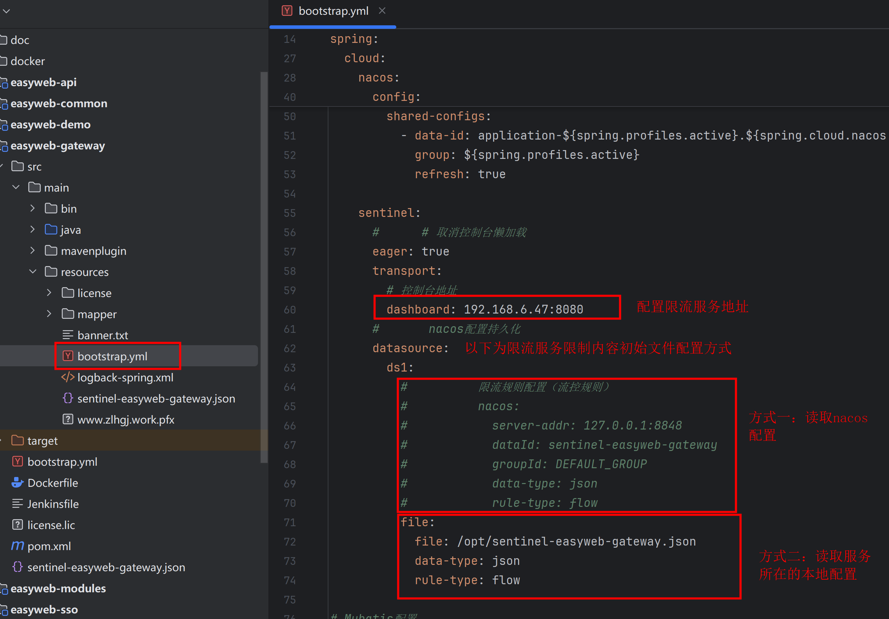

# sentinel-1.8.8下载
### 1. 限流服务
   限流服务在并发高的应用可以起限流作用

### 2.启动说明
   第一步：启动限流服务
   第二步：网关配置需连接限流服务的地址以及需要限流的服务与阈值数量
   如图所示：
   

::: tip sentinel-1.8.8公司网下载
[sentinel-1.8.8](http://192.168.3.35/prod-api/oss/api/download/EW00-240730161304-8497089769740738567700011385815043833 "sentinel-1.8.8")
:::
