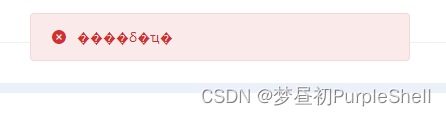

# 常见问题

## 一、only regular white space (\r, \n, \t) is allowed between tokens

```java
Caused by: com.fasterxml.jackson.core.JsonParseException: Illegal character ((CTRL-CHAR, code 31)): only regular white space (\r, \n, \t) is allowed between tokens
 at [Source: (PushbackInputStream); line: 1, column: 2]

```


该异常是由于Spring Cloud Feign 请求其他微服务时json数据被压缩导致的，可以调整feign配置如下

```yaml
feign:
  compression:
    request:
      enabled: false
    response:
      enabled: false
```


## 二、Windows下RequestBody里中文格式JSON解析报错

springboot内置tomcat启动服务出现异常提示中文乱码，保存数据json解析异常等问题，折腾了半天，原来用cmd窗口直接启动跟放bat里执行效果是不一样的：
### 走过的弯路
  + 1、配置1无效
```yaml
# Tomcat
server:
  port: 8089
  tomcat:
    uri-encoding: UTF-8 
```
  + 2、配置2无效
```yaml
spring:
  http:
    encoding:
      force: true
      charset: UTF-8
      enabled: true
```
  + 3、java代码调整produces = {"application/json; charset=utf-8"})  无效
发现java代码里没有写produces = {"application/json; charset=utf-8"})

```java
@PostMapping(value = "/add", produces = {"application/json; charset=utf-8"})
```
  + 4、直接cmd执行 java -jar命令无效

### 异常提示中文乱码

### 提交数据json解析异常
```java
400 BAD_REQUEST "Failed to read HTTP message"; nested exception is org.springframework.core.codec.DecodingException: JSON decoding error: Invalid UTF-8 start byte 0xb6; nested exception is com.fasterxml.jackson.databind.JsonMappingException: Invalid UTF-8 start byte 0xb6 at [Source: (io.netty.buffer.ByteBufInputStream); line: 1, column: 54] (through reference chain: com.evn.gateway.entity.GatewayRoute["serviceName"])
```

+ 解决方式   用bat执行，运行正常
  - 1、通过bat启动程序
  - 2、启动命令添加“-Dfile.encoding=UTF-8”  
   启动命令（java -Dfile.encoding=UTF-8 -jar  -Xms128m -Xmx256m XXX.jar）
   docker启动（docker run -e JAVA_OPTS='-server -Xms128m -Xmx128m -Dfile.encoding=UTF-8' -d --name name -p port:portimage:1.0）
   在双击执行bat启动生效 ，提示正常了，提交数据也能成功。


## 三、springcloud feign调用时间相差8小时

服务A调用服务B传包含date类型的对象，B服务接收到date比A服务晚8小时，试过FeignDateFormatRegister 日期格式化方式，也试过如下参数设置都不生效

```yaml
spring:
  jackson:
    date-format: yyyy-MM-dd HH:mm:ss
    time-zone: GMT+8
```

最后在实体类字段定义@JsonFormat添加时区timezone = "GMT+8"属性解决
    @JsonFormat(pattern = "yyyy-MM-dd HH:mm:ss", timezone = "GMT+8")


## 四、数据库字段位数不够补足位数
### oracle、达梦处理方式
#### 左侧补0
```sql
update sys_region set parent_region_id=lpad(parent_region_id,12,'0') where parent_region_id!='-1';
```

#### 右侧补0
```sql
update sys_region set parent_region_id=rpad(parent_region_id,12,'0') where parent_region_id!='-1';
```


## 五、Windows端口被占用
1、使用快捷键Windows+R，打开运行，输入cmd，打开Windows 命令窗口

2.、然后执行命令 netstat -nao | findstr 端口号  查询占用此端口的程序pid

3、执行命令 tasklist | findstr 29292（此处29292根据第二步骤所查询到的pid 输入，不同情况pid不同，大家要根据第二步骤输入对应pid）

4、执行taskkill /f /t /im 进程名/pid   (如果用pid的话可以省略第三步就可以顺利关闭占用端口的程序)


# 工作流问题


:tada: :100:

::: tip 提示
this is a tip
:::

::: warning 注意
this is a tip
:::

::: danger 警告
this is a tip
:::

<!-- ::: details
这是一个详情块，在 IE / Edge 中不生效
::: -->

``` js
<script>
	console.log('Hello world')
</script>
```